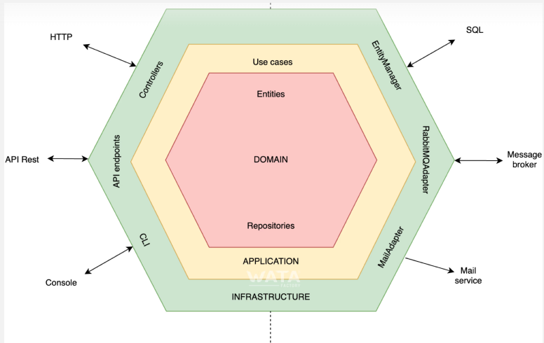

# Semana 2: Arquitectura de Software  
Monolítica, Modular y Hexagonal (Clean/DDD/Lightweight)  

---

## Aprendizaje Esperado
- Diferenciar entre arquitectura **monolítica, modular y hexagonal**.  
- Comprender los fundamentos de **Clean Architecture** y **Domain-Driven Design (DDD)**.  
- Aplicar principios de separación de capas para construir sistemas mantenibles.  
- Implementar un ejemplo práctico con arquitectura monolítica y refactorización hacia hexagonal.  

---
### ¿Qué es la arquitectura de software?

- La arquitectura de software es como el “plano” de un edificio, pero aplicado a un programa.
- Define cómo se organiza el código y cómo se comunican las diferentes partes de una aplicación.


### Arquitectura Monolítica
**Definición:** Todo el sistema se construye y despliega como un único bloque (código, UI, lógica y persistencia).  ejemplo: local de comida rapida

- ✅ **Ventajas:** Simplicidad, despliegue único, bajo costo inicial.  
- ❌ **Desventajas:** Difícil de escalar, fuerte acoplamiento, bajo aislamiento de fallos.  


``` python
def registrar_usuario(nombre, email):
    print(f"Guardando usuario {nombre} en la base de datos...")
    print(f"Enviando correo de bienvenida a {email}...")

registrar_usuario("Mateo", "mateo@heaven.com")

```

- [👎 Anti-ejemplo (monolito en un archivo)] ejemplos/monolitico/app.py)  
- [👍 Ejemplo modularizado] ejemplos/modular_bien/user_service.py)

---

### Arquitectura Modular
**Definición:** División en módulos (capas o paquetes) dentro del mismo monolito. ejemplo: un hospital.   

- ✅ **Ventajas:** Organización más clara, separación parcial de responsabilidades.  
- ❌ **Desventajas:** Sigue siendo un despliegue único; módulos aún acoplados.  

``` python
# modulo usuarios
def guardar_usuario(nombre, email):
    print(f"[DB] Usuario {nombre} guardado")

# modulo emails
def enviar_email(email, mensaje):
    print(f"[EMAIL] Enviando a {email}: {mensaje}")

# programa principal
def registrar_usuario(nombre, email):
    guardar_usuario(nombre, email)
    enviar_email(email, "Bienvenido a la aplicación!")

registrar_usuario("Marcos", "marcos@heaven.com")

```


- [👎 Anti-ejemplo (módulos acoplados)] ejemplos/modular_mal/app.py)  
- [👍 Ejemplo modular correcto] ejemplos/modular_bien/app.py)  

---

### Arquitectura Hexagonal (Ports & Adapters)(I-C-D)
**Definición:** Divide la aplicación en un **núcleo (dominio)** con lógica de negocio, rodeado por **puertos** (interfaces) y **adaptadores** (implementaciones concretas como BD, API, UI).
ejemplo: consola de video juegos  

- ✅ **Ventajas:** Independencia de frameworks y bases de datos, fácil de probar, altamente extensible.  
- ❌ **Desventajas:** Mayor complejidad inicial.  

``` python
# dominio
class Usuario:
    def __init__(self, nombre, email):
        self.nombre = nombre
        self.email = email

# puerto (interfaz)
class EmailService:
    def send(self, to, mensaje):
        pass

# adaptador concreto
class ConsoleEmailService(EmailService):
    def send(self, to, mensaje):
        print(f"[EMAIL] Para: {to} | {mensaje}")

# aplicación
usuario = Usuario("Lucas", "lucas@heaven.com")
email_service = ConsoleEmailService()
email_service.send(usuario.email, "Bienvenida a la app hexagonal!")

```


- [👎 Anti-ejemplo (dependencia directa de infraestructura)] ejemplos/hexagonal_mal/app.py)  
- [👍 Ejemplo con puertos y adaptadores] ejemplos/hexagonal_bien/main.py)  

## Diagrama de Arquitectura Hexagonal

La siguiente imagen muestra cómo funciona la arquitectura **Hexagonal (Ports & Adapters)**:



## Comparación de Arquitecturas de Software


#### leer Vertical Slicing
---

# 🏗️ Clean Architecture & DDD (Lightweight)

## ¿Qué es Clean Architecture?
- Es una forma de organizar el código para que sea **fácil de entender, probar y mantener**.  
- Propuesta por **Robert C. Martin (Uncle Bob)**.  
- La idea principal: separar el programa en **capas** con diferentes responsabilidades.  

**Metáfora:**  
Piensa en una **cebolla con capas**:  
- En el centro está lo más importante: la **lógica del negocio**.  
- Las capas externas son detalles como la base de datos, la interfaz gráfica o los correos electrónicos.  
- Si cambia una capa externa (ej: de MySQL a MongoDB), el centro (reglas del negocio) no debería cambiar.

---

## Capas de Clean Architecture
1. **Entidad / Dominio (Core):**  
   - Contiene las **reglas del negocio**.  
   - Ejemplo: qué significa “usuario válido”, “producto disponible”.  
   - **No sabe nada de la base de datos ni de la interfaz.**

2. **Casos de Uso (Application):**  
   - Contienen los **flujos de la aplicación**.  
   - Ejemplo: “registrar un usuario”, “comprar un producto”.  
   - Usan las entidades del dominio para orquestar acciones.

3. **Adaptadores (Infrastructure):**  
   - Implementaciones concretas (BD, APIs, emails).  
   - Se pueden cambiar sin afectar el núcleo.

4. **Interfaz de Usuario (UI):**  
   - Cómo el usuario interactúa con la aplicación.  
   - Puede ser consola, web, móvil, etc.

---

## ¿Qué es Domain-Driven Design (DDD)?
- Es una forma de **pensar el software desde el negocio**, no desde la tecnología.  
- Se centra en el **“lenguaje ubicuo”**: usar las mismas palabras que usan los expertos del dominio (ej: “pedido”, “factura”, “cliente”).  

- DDD propone:  
  - **Entidades:** objetos con identidad (ej: Usuario, Pedido).  
  - **Value Objects:** datos sin identidad (ej: Email, Dirección).  
  - **Repositorios:** encargados de guardar y recuperar entidades.  
  - **Servicios de Dominio:** lógica que no pertenece a una sola entidad.  
  - **Bounded Contexts:** dividir el sistema en áreas del negocio (ej: ventas, inventario).  

👉 **Ligero (Lightweight):** aplicamos solo lo esencial para principiantes:  
- Usar entidades y value objects.  
- Separar la lógica del negocio de los detalles técnicos.  

---

## Ejercicio Práctico dia lunes/viernes
1. Implementar un **registro de usuarios** como monolito (todo en un archivo).  
2. Refactorizar el código a una **arquitectura modular** con paquetes.  
3. Evolucionar el sistema a **hexagonal**, introduciendo interfaces (ports) y adaptadores.  
4. Entregar en GitHub de sus proyectos en carpetas:  
   - `ejemplos/monolitico/`  
   - `ejemplos/modular/`  
   - `ejemplos/hexagonal/`  
   - `README.md` explicando la evolución.  

---

## Recursos
- *Clean Architecture* – Robert C. Martin.  
- *Domain-Driven Design: Tackling Complexity in the Heart of Software* – Eric Evans.  
- [Hexagonal Architecture by Alistair Cockburn](https://alistair.cockburn.us/hexagonal-architecture/)  
